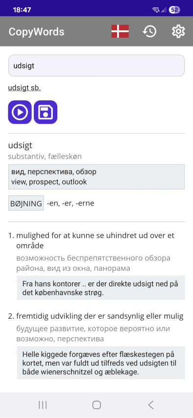
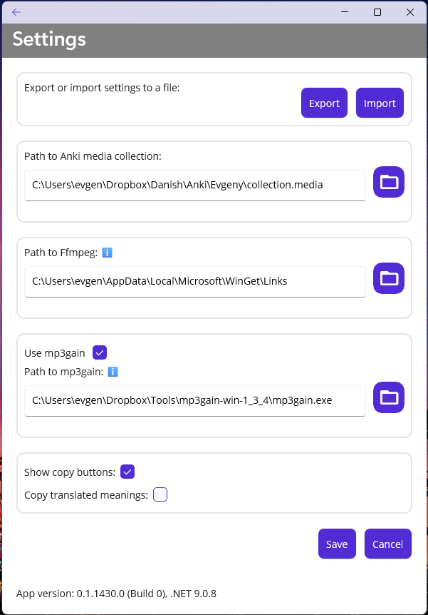
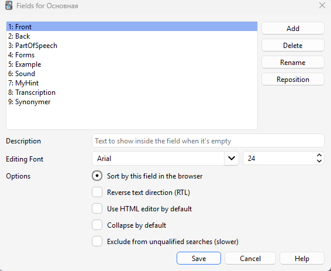
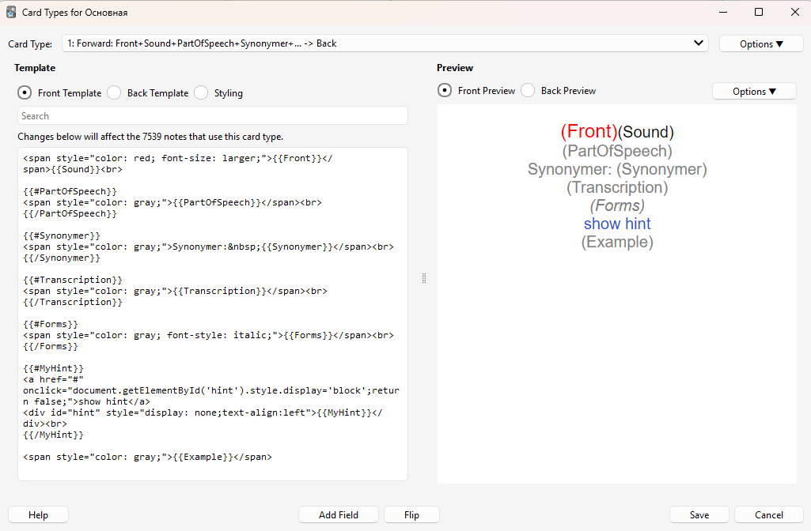
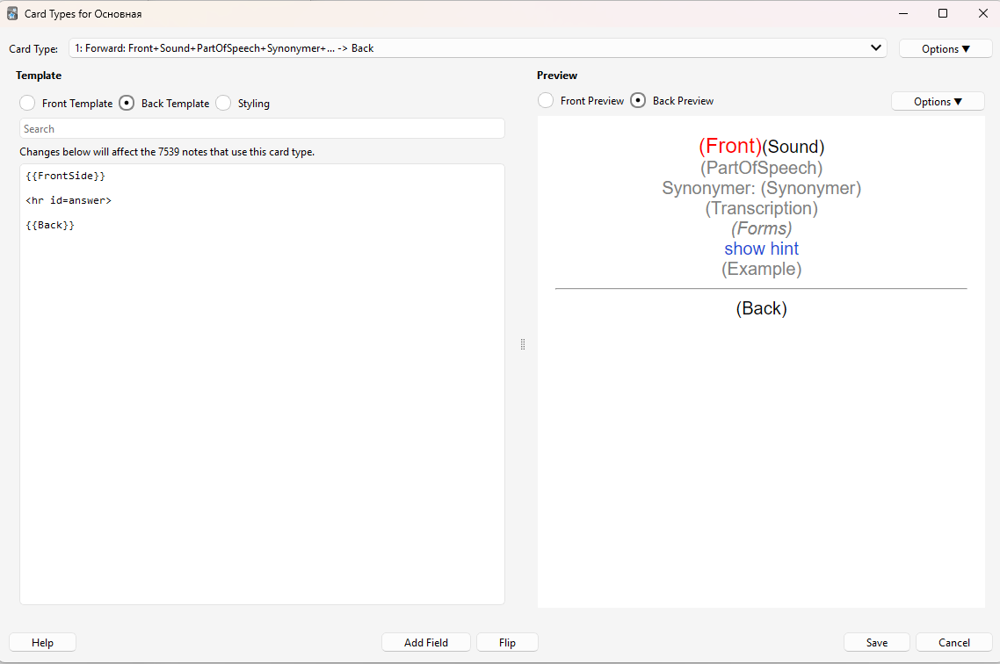
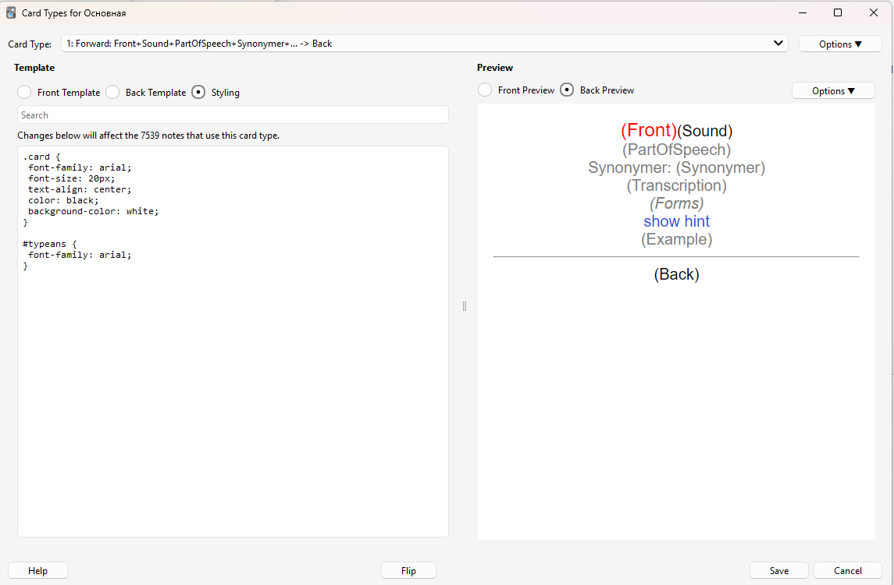
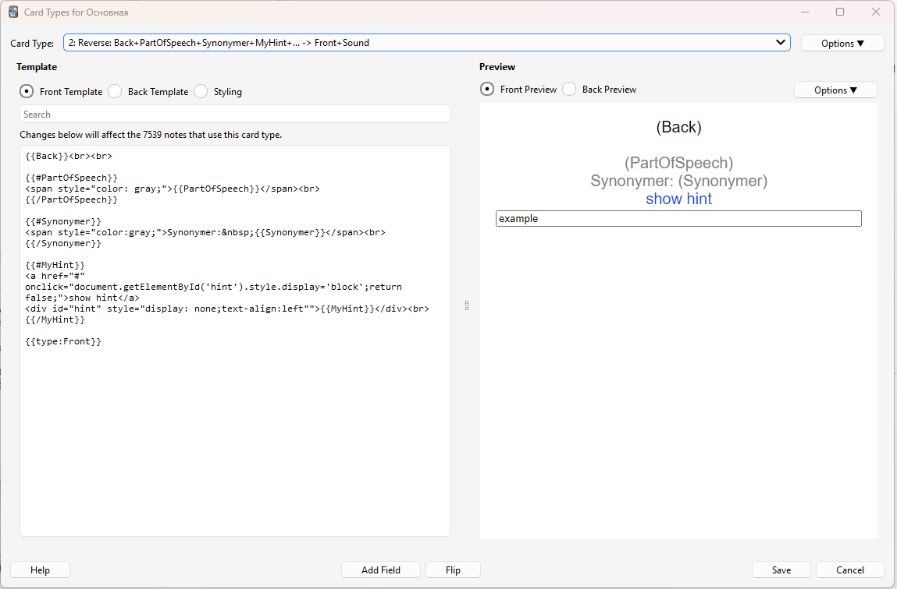
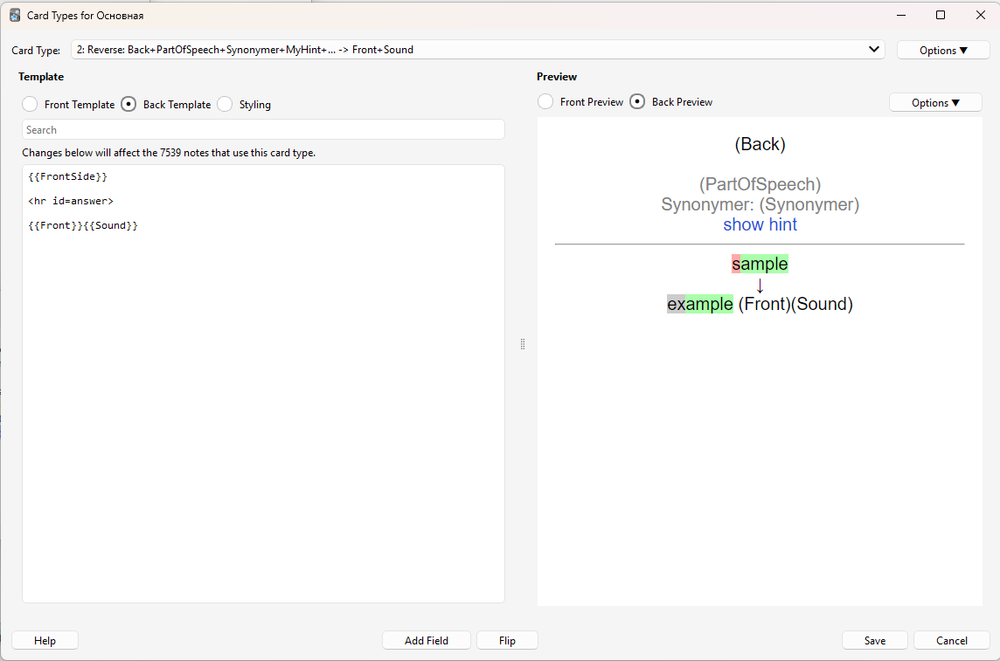

# CopyWords

CopyWords is a helper tool for adding new Danish or Spanish words to the [Anki](http://ankisrs.net/) flashcard system.

## Features

- **Anki integration**
  The Anki card template has been customized to include extra details about each word, such as its transcription, audio file, and more. CopyWords makes creating new cards easier by automatically looking up words in online dictionaries and extracting their components. With the **"Copy text"** buttons, users can copy specific information to the clipboard and paste it directly into the Anki editor.

- **Dictionary mode**
  CopyWords can also be used as a simple online dictionary. In this mode, all buttons are hidden except **"play sound"** and **"save sound"**, making it useful for quick lookups with translations from Danish or Spanish.

## Technology

CopyWords is built with [Microsoft .NET MAUI](https://learn.microsoft.com/en-us/dotnet/maui/what-is-maui) and currently runs on both Windows and Android.

## Installation

### Android

Download apk file from [Releases ](https://github.com/evgenygunko/CopyWordsDA/releases) and install.

### Windows

To install a MAUI app you need to add a code signing certificate [(*.cer file)](https://github.com/evgenygunko/CopyWordsDA/releases) used for singing the app into the trusted certificates store.

See this answer https://stackoverflow.com/a/75940629
1. Open the Certificate, MyApp.cer, by double-clicking.
2. Click on Install Certificate
3. In the Certificate Import Wizard window,
   - Select Local Machine and click Next
   - Select Place all certificates in the following store
   - Browse and select Trusted Root Certification Authorities
   - Click Next and take defaults. After this you should see a pop-up stating that "The import was successful."

You now can proceed to side-load install the .NET MAUI app.

## How to Use

## Dictionary mode
1. Select the source language.
2. Type a word (or part of it) in the Search box and click the **Search** button.

### Copy mode

1. Select the source language.
2. Type a word (or part of it) in the Search box and click the **Search** button.
3. If the word exists in the online dictionary, it will be parsed and presented within the tool.
4. Use the **Copy** buttons to copy the relevant text into the clipboard and paste it into the Anki card editor.

**Note:** The screenshot is taken on Windows, as it is easier to copy different parts of a word there.
On Android, you can also copy the **front** and **back** fields.

## Sound Functionality

- The **Play sound** button downloads an MP3 file (if available) and plays it.
- The **Save sound** button normalizes the sound file (adjusting its volume) and saves it to Anki's media collection folder.Normalizing the sound requires a tool called mp3Gain and is optional.

## Translations

CopyWords integrates with a companion web application to provide translations for headlines and definitions.
The service is available in the [Translations](https://github.com/evgenygunko/Translations/tree/master) repository.

## Settings

The settings dialog can be accessed by clicking the **Settings** button in the app bar.

- **Export**: Exports current settings as a json file.
- **Import**: Imports settings from a json file.
- **Path to Anki Media Collection**: Specifies the path to Anki's media collection folder for the current user. This folder contains the media files displayed or played on Anki cards.
- **Path to FFMpeg**: Specifies the path to the [ffmpeg](https://www.ffmpeg.org/) utility, which is used to convert audio files from video formats to MP3.
- **Path to MP3Gain**: Specifies the path to the [mp3gain](http://mp3gain.sourceforge.net/) utility, which is used to normalize the sound volume of MP3 files. Using this tool is optional.
- **Show copy buttons**: selects copy or dictionary mode.

## Card Templates (if you decide to use it for adding Anki cards)

Anki card templates can be customized but unfortunately, they cannot be exported directly. Templates are saved with a "deck," which is a set of cards the user wants to learn. Users can add new cards with new words to their collection, making learning and memorization more efficient.

1. Open Anki, click Tools -> Manage Note Types -> Add. Add a name for your new note type.
2. Select your note type and click "Fields". Add the following fields:
   - Front
   - Back
   - PartOfSpeech
   - Forms
   - Example
   - Sound
   - MyHint
   - Transcription
   - Synonymer

3. Click cards and add Forward and Reverse cards:

    **Forward Card Template**
    The word in the foreign language is shown, and you need to guess the translation.
  - [front.html](./card_templates/Forward_card_front_template.html)
    
  - [back.html](./card_templates/Forward_card_back_template.html)
    
  - [styling.css](./card_templates/Forward_card_styling.css)
    

    **Reverse Card Template**
    The translation is shown, and you need to type the word in the foreign language.
  - [front.html](./card_templates/Reverse_card_front_template.html)
    
  - [back.html](./card_templates/Reverse_card_back_template.html)
    
  - [styling.css](./card_templates/Reverse_card_styling.css)
    
