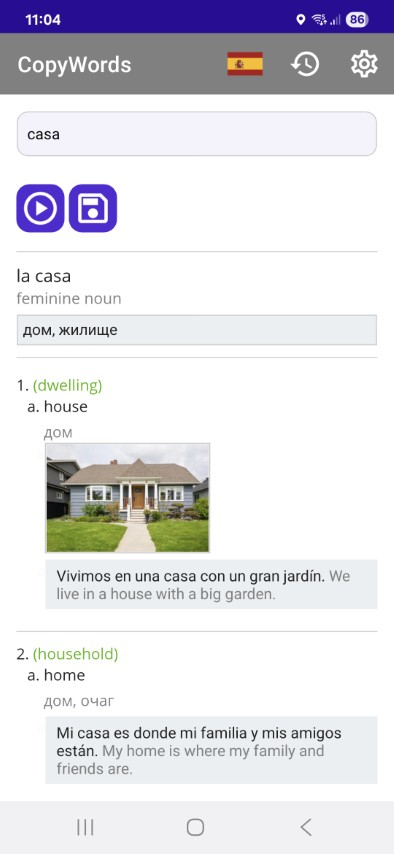
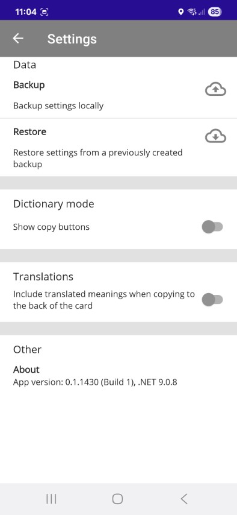

# CopyWords

CopyWords is a simple dictionary app for looking up Danish or Spanish words.
It provides quick access to translations, pronunciation, and sound files - all in one place.

While CopyWords was originally created to help with [Anki](http://ankisrs.net/) flashcards, the **dictionary mode** makes it useful even if you only want to look up words and hear how they sound.

If you’re interested in using CopyWords together with Anki, see the [Copy Mode documentation](./README_COPY_MODE.md).

---

## Features

- **Dictionary mode**
  - Look up Danish or Spanish words in online dictionaries
  - View translations and definitions
  - Play or save sound files for pronunciation practice

- **Copy words mode**
  - CopyWords integrates with a companion web service to translate headlines and definitions.
    See the [Translations project](https://github.com/evgenygunko/Translations/tree/master).

---

## How to Use

### Dictionary mode

1. Select the source language (Danish or Spanish).
2. Type a word (or part of it) in the **Search** box.
3. Click the **Search** button.
4. Use the **Play sound** button if audio is available.

Danish dictionary:

Spanish dictionary:

---

## Installation

### Android

You can install CopyWords on Android by downloading the APK file from the [Releases](https://github.com/evgenygunko/CopyWordsDA/releases) page.

1. Download the latest `CopyWords.apk` file to your device.
2. On your Android device, open the **Downloads** folder (or the location where you saved the file).
3. Tap the APK file to begin installation.
4. If prompted, allow installation from **Unknown Sources** (this may appear as “Allow from this source” in your device’s settings).
5. Follow the on-screen instructions to complete installation.

After installation, you will see the **CopyWords** app icon in your app drawer and can launch it directly.

### Windows

To install a .NET MAUI app on Windows, you need to add the provided code signing certificate to the trusted certificates store.

See [this answer](https://stackoverflow.com/a/75940629) for details.

1. Open the certificate file (`MyApp.cer`) by double-clicking it.
2. Click **Install Certificate**.
3. In the **Certificate Import Wizard**:
   - Select **Local Machine** and click **Next**
   - Select **Place all certificates in the following store**
   - Browse and select **Trusted Root Certification Authorities**
   - Click **Next** and accept defaults

After this, you should see:
**"The import was successful."**

You can then side-load the CopyWords app.

---

## Settings

The settings dialog is accessible by tapping the **Settings** button (gear icon) in the app bar.

**Available settings on Android:**

- **Dictionary mode**: Switch between **Dictionary mode** (for word lookup and pronunciation) and **Copy mode** (for preparing Anki flashcards).
- **Include translated meanings**: When enabled in Copy mode, both the translated text and the original meaning are copied to the back of the card.
- **Anki settings**: Allows you to select a deck and a note type for automatically created Anki notes.
- **Theme**: Switch between Dark and Light themes.

---
## Technology

CopyWords is built with [Microsoft .NET MAUI](https://learn.microsoft.com/en-us/dotnet/maui/what-is-maui) and runs on Windows, MacOS (via MacCatalyst), and Android.

---

## Translations

CopyWords provides translations for headlines and definitions through a companion web application.
This service uses an OpenAI language model (LLM) to generate translations.

> ⚠️ Note: Translations may not always be accurate. They are produced by an algorithm, not by humans.

---

## More Information

- [Copy Mode & Anki Integration](./README_COPY_MODE.md)
- [Card Templates for Anki](./README_CARD_TEMPLATES.md)
- [Development Guide](./README_DEVELOPMENT.md)
