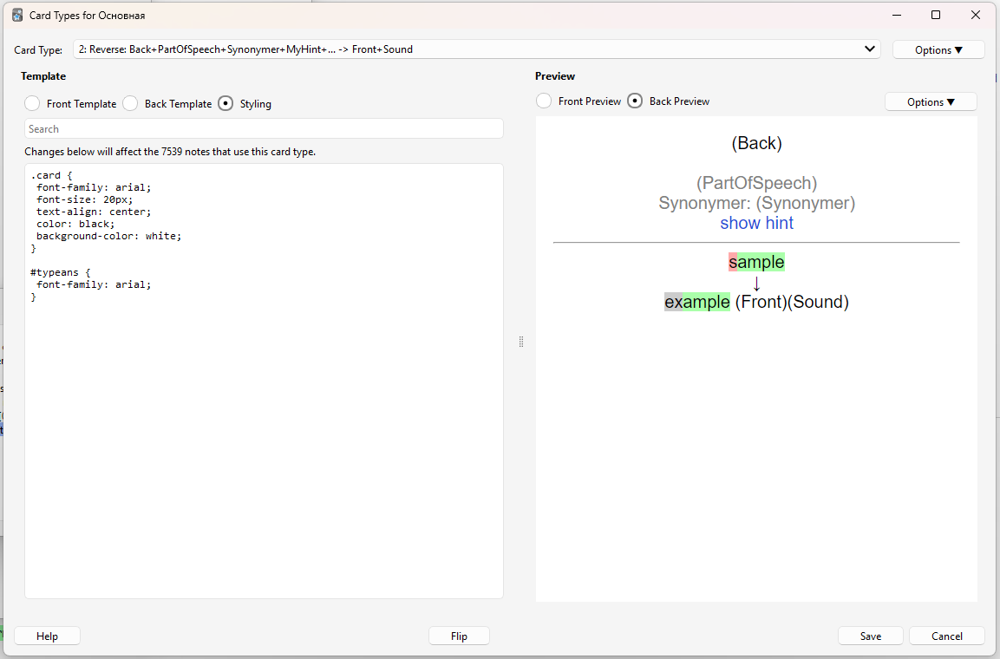

# CopyWords

This is a helper tool for adding new Danish or Spanish words to [Anki](http://ankisrs.net/) flashcard system.

I have customized Anki's card template to include additional information about a word, such as transcription, sound file, and more. The CopyWords tool simplifies the process of adding new cards by automatically searching for a word in online dictionaries and parsing different parts of it. You can then click on various "Copy text" buttons to copy the information to the clipboard and paste it into the Anki editor.

The app is built using [Microsoft .NET MAUI](https://learn.microsoft.com/en-us/dotnet/maui/what-is-maui) technology and runs on both Windows and macOS.

## How to Use

1. Select the source language. For Danish we will use the [Den Danske Ordbog](http://ordnet.dk/ddo/) and for Spanish we will use [SpanishDict](https://www.spanishdict.com/) online dictionary.
2. Type a word (or part of it) in the Search box and click the **Search** button.
3. If the word exists in the online dictionary, it will be parsed and presented within the tool.
4. Use the **Copy** buttons to copy the relevant text into the clipboard and paste it into the Anki card editor.

## Sound Functionality

- The **Play sound** button downloads an MP3 file (if available) and plays it.
- The **Save sound** button normalizes the sound file (adjusting its volume) and saves it to Anki's media collection folder.Normalizing the sound requires a tool called mp3Gain and is optional.

## Translations

The app can call an Azure Function App (refer to this repository: [Azure Translations](https://github.com/evgenygunko/Translations/tree/master)) to translate headlines and definitions. This feature can be enabled or disabled in the **Settings**.

## Settings

The settings dialog can be accessed by clicking the **Settings** button in the app bar.

- **Export**: Exports current settings as a json file.
- **Import**: Imports settings from a json file.
- **Path to Anki Media Collection**: Specifies the path to Anki's media collection folder for the current user. This folder contains the media files displayed or played on Anki cards.
- **Path to FFMpeg**: Specifies the path to the [ffmpeg](https://www.ffmpeg.org/) utility, which is used to convert audio files from video formats to MP3.
- **Path to MP3Gain**: Specifies the path to the [mp3gain](http://mp3gain.sourceforge.net/) utility, which is used to normalize the sound volume of MP3 files. Using this tool is optional.
- **Translator API URL**: Specifies the URL for the [Translator app](https://github.com/evgenygunko/Translations) which can return translations in additional langugages. Using this tool is optional.

## Card Templates

Anki card templates can be customized but unfortunately, they cannot be exported directly. Templates are saved with a "deck," which is a set of cards the user wants to learn. Users can add new cards with new words to their collection, making learning and memorization more efficient.

My card templates:

- **Forward Card Template**: The word in the foreign language is shown, and you need to guess the translation.
  
  
  

- **Reverse Card Template**: The translation is shown, and you need to type the word in the foreign language.
  
  
  

  See examples:

- **Forward Card Template**:

  - [front.html](./card_templates/Forward_card_front_template.html)
  - [back.html](./card_templates/Forward_card_back_template.html)
  - [styling.css](./card_templates/Forward_card_styling.css)

- **Reverse Card Template**:
  - [front.html](./card_templates/Reverse_card_front_template.html)
  - [back.html](./card_templates/Reverse_card_back_template.html)
  - [styling.css](./card_templates/Reverse_card_styling.css)
