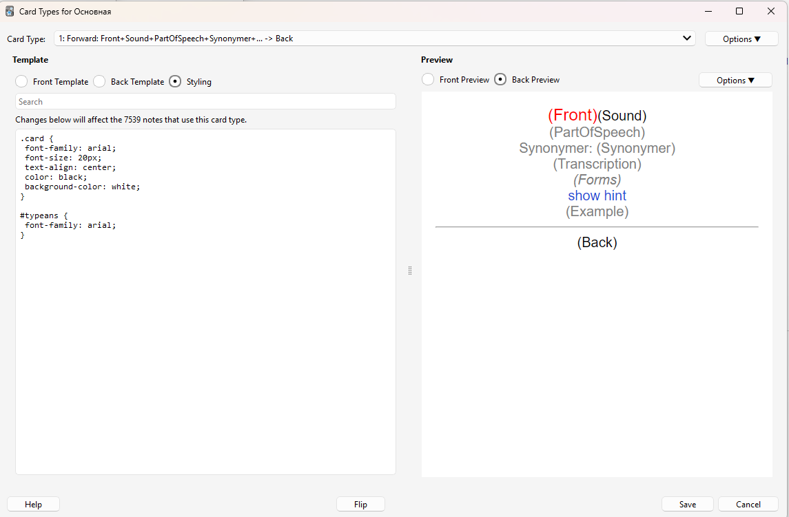

# Card Templates for CopyWords

Anki card templates can be customized, but they cannot be exported directly. Templates are saved with a “deck,” which is a set of cards the user wants to learn.

To create a new template for CopyWords:

1. Open Anki → **Tools → Manage Note Types → Add**.
   Enter a name for your new note type.
2. Select your note type and click **Fields**. Add the following fields:
   - Front
   - Back
   - PartOfSpeech
   - Forms
   - Example
   - Sound
   - MyHint
   - Transcription
   - Synonymer

3. Click **Cards** and add Forward and Reverse cards:

---

## Forward Card Template

The word in the foreign language is shown, and you need to guess the translation.

- [front.html](./card_templates/Forward_card_front_template.html)
  
- [back.html](./card_templates/Forward_card_back_template.html)
  
- [styling.css](./card_templates/Forward_card_styling.css)
  

---

## Reverse Card Template

The translation is shown, and you need to type the word in the foreign language.

- [front.html](./card_templates/Reverse_card_front_template.html)
  
- [back.html](./card_templates/Reverse_card_back_template.html)
  
- [styling.css](./card_templates/Reverse_card_styling.css)
  

---

## Related

- [Main README (Dictionary Mode)](./README.md)
- [Copy Mode](./README_COPY_MODE.md)
