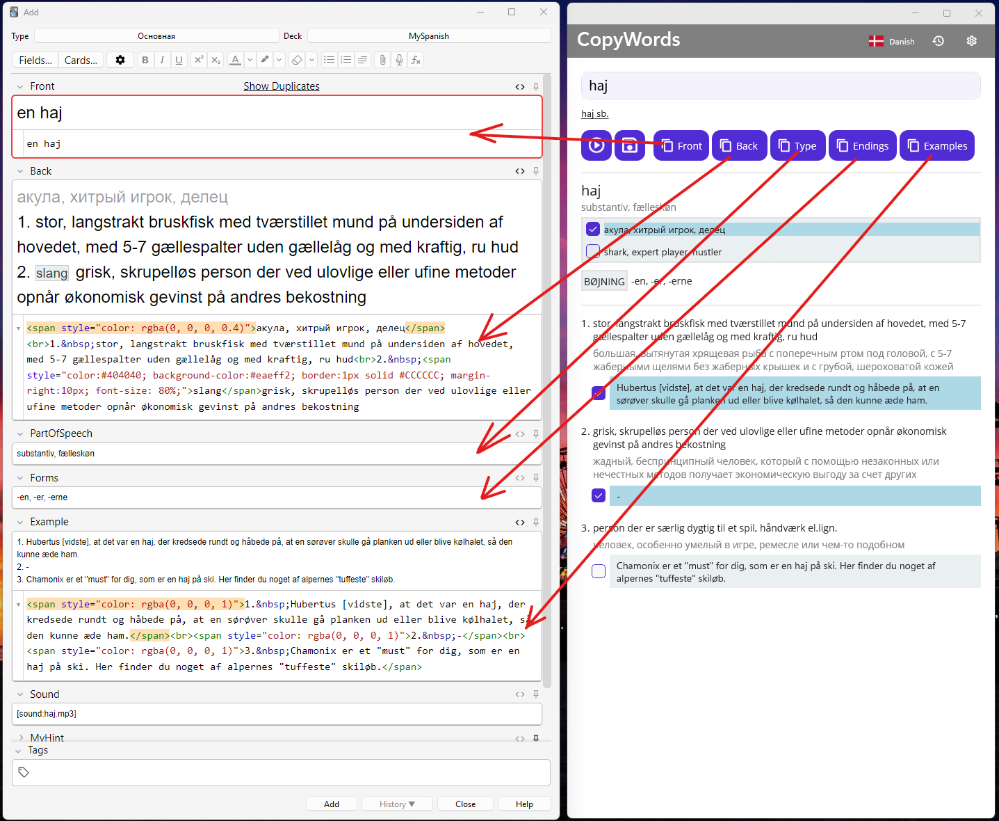

# Copy Mode and Anki Integration

CopyWords was originally created to make it easier to add new Danish or Spanish words to the [Anki](http://ankisrs.net/) flashcard system.
In **Copy Mode**, the app automatically extracts word details from online dictionaries so you can quickly copy them into your Anki cards.

---

## How to Use Copy Mode

### Prerequisites

Before using Copy Mode, you need to set up a note type in Anki with the required fields. See the [Card Templates](./README_CARD_TEMPLATES.md) guide for detailed instructions on creating a note type with these fields:

- Front
- Back
- PartOfSpeech
- Forms
- Example
- Sound

### Using Copy Mode

1. Select the source language.
2. Type a word (or part of it) in the **Search** box and click **Search**.
3. If the word exists in the online dictionary, its details will be parsed and displayed.
4. Click the **Anki** button to automatically add the card to Anki (recommended method).

### Adding Cards with the Anki Button (Recommended)

The **Anki** button is the preferred and most efficient way to add new cards to Anki. It requires minimal effort—just one click—and automatically creates a complete note in Anki with all word details filled in.

The integration works seamlessly across platforms:

- **Windows / MacCatalyst**: Uses the [Anki-Connect](https://git.sr.ht/~foosoft/anki-connect) addon to communicate with the desktop Anki application.
- **Android**: Uses the [AnkiDroid API](https://github.com/ankidroid/Anki-Android/wiki/AnkiDroid-API) to integrate directly with AnkiDroid.

This automated approach eliminates manual copying and pasting, saving you time and reducing errors.

### Manual Card Creation (Alternative Method)

If you prefer manual control over the card creation process, you can use the individual **Copy** buttons:

1. Use the **Copy** buttons to copy specific parts of the word (front, back, etc.) to the clipboard.
2. Open the Card Browser in Anki (on Windows or MacCatalyst) or create a new card manually.
3. Paste the copied text into the appropriate fields in the note editor.

**Note:** On Windows, you can copy individual word components separately. On Android, you can copy the **front** and **back** fields.

---

## Sound Functionality

- **Play sound**: Downloads an MP3 file (if available) and plays it.
- **Save sound**: Saves the sound file to Anki's media collection folder.

---

## Settings

The settings dialog can be opened by clicking the **Settings** button in the app bar.

- **Show copy with AnkiConnect**: Allows to create notes with AnkiConnect addon.
- **Path to Anki Media Collection**: Allows you to select the path to the Anki media collection folder where CopyWords saves image and audio files.
- **Show copy buttons**: Switch between dictionary mode and copy mode.
- **Copy translated meanings**: Include translated meanings when copying word details.
- **Theme**: Switch between Dark and Light themes.

---

## Related

- [Main README (Dictionary Mode)](./README.md)
- [Card Templates](./README_CARD_TEMPLATES.md)
